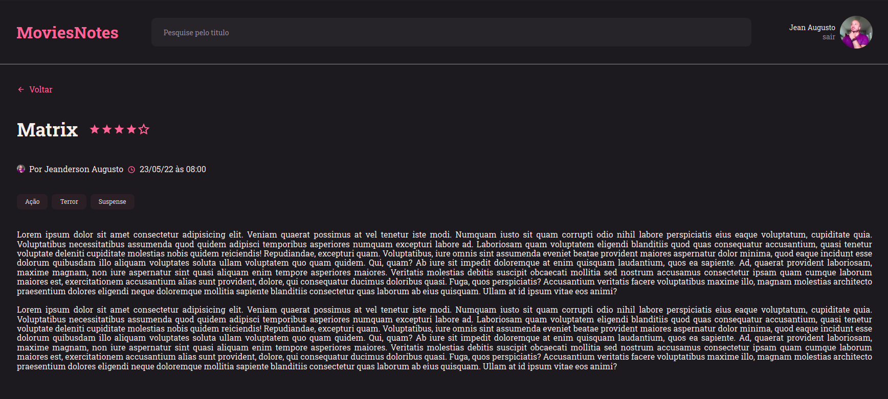

# MovieNotes

Application to include notes related to films watched by the user.

SignIn screen:

  

SignUp screen:

  

Home:

  

Create Note:

  

Note preview:

  

Edit perfil:

  

This project was developed with the following technologies:

- React
- Vite
- Styled Components
- Git/Github
- Figma

